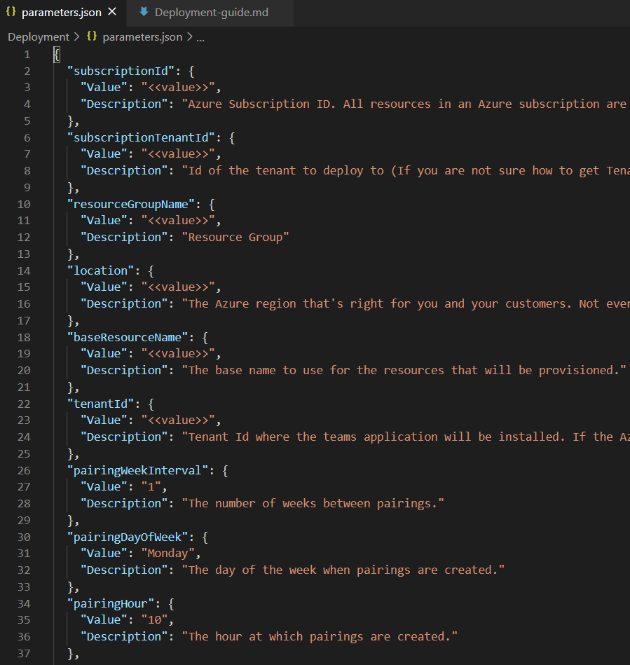
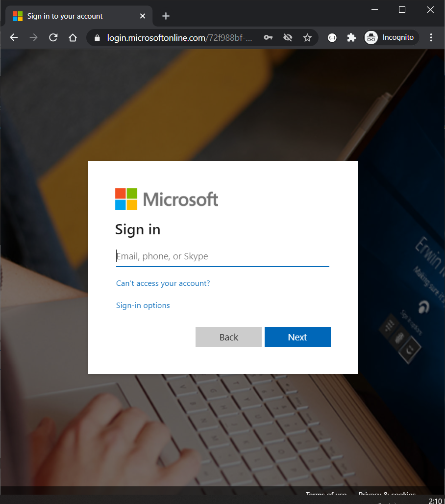
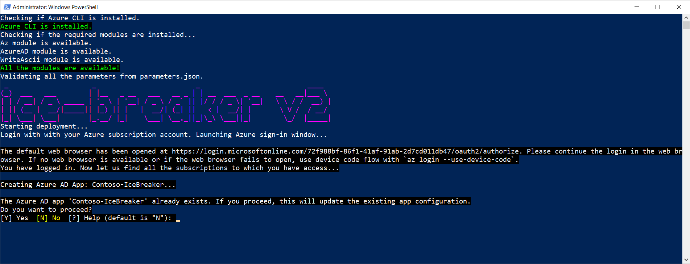
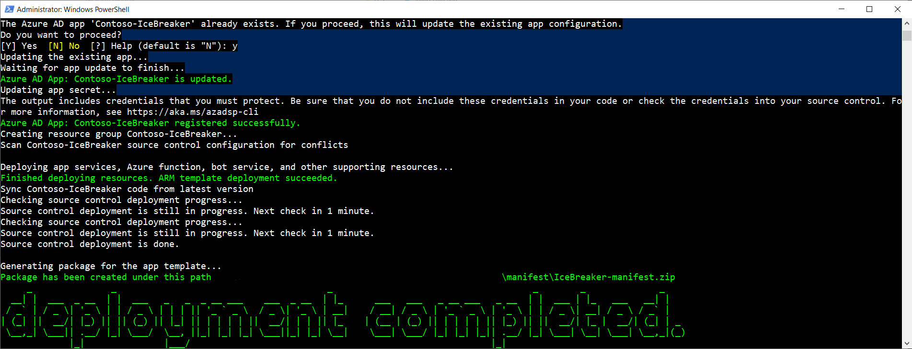

- [Deployment Guide](#)
    - [Prerequisites](#prerequisites)
    - [Steps](#Deployment-Steps)
        - [Deploy to Azure subscription](#1-deploy-to-your-azure-subscription)
        - [Update parameters.json file](#2-Update-parameters.json-file)
        - [Execute script](#3-execute-script)
        - [Run the app in Microsoft Teams](#4-run-the-app-in-microsoft-teams)
    - [Troubleshooting](#troubleshooting)
***

# Prerequisites

To begin, you will need:
* An Azure subscription where you can create the following kinds of resources:
    * Azure Logic App
    * App service
    * App service plan
    * Bot channels registration
    * Azure Cosmos DB account
    * Application Insights
* A copy of the Icebreaker app GitHub repo (https://github.com/officedev/microsoft-teams-icebreaker-app)
* This is not a pre-requisite per se, but here is a video walk-through of this deployment if you'd like to follow along as you go through your own deployment. [Icebreaker video walkthrough](https://www.youtube.com/watch?v=BkoLT3MEtZg)

# Deployment Steps

*For manual deployment (old approach) please use this [deployment guide](/Wiki/Deployment-Guide-manual.md).*

## 1. Deploy to your Azure subscription

  Please follow below steps to deploy app template:

- Download the whole solution folder from [GitHub](https://github.com/OfficeDev/microsoft-teams-apps-icebreaker)
- Unzip the Content to a folder. (say IceBreaker)
- Open a PowerShell window in **administrator** mode and navigate to the folder where you unzipped the content.
- Navigate to Deployment folder.
    ```  
    cd IceBreaker\Deployment
    ```
- Run the below command. This will allow you to run deploy.ps1. By default, the execution policy is restricted. You may change it to back restricted after deployment is completed.
    ```
    Set-ExecutionPolicy -ExecutionPolicy RemoteSigned
    ```
- Run the below command to unblock the deployment script.
    ```
    Unblock-File -Path .\deploy.ps1
    ```
---
## 2. Update parameters.json file
- You will find a `parameters.json` file under Deployment folder. Please update all the parameters.

  

- Replace `<<value>>` with appropriate value for all the required fields. Make sure you review the default values for optional fields.
- You may refer to the following:

    - `subscriptionId` - Azure subscription to deploy the solution to (MUST be associated with the Azure AD of the Office 365 tenant that you wish to deploy this solution to.) e.g. 22f602c4-1b8f-46df-8b73-45d7bdfbf58e.
    - `subscriptionTenantId` - Id of the tenant to deploy to (If you are not sure how to get Tenant ID, please check Azure Active Directory in Azure Portal. Under Manage, click Properties. The tenant ID is shown in the Directory ID box). e.g 98f3ece2-3a5a-428b-aa4f-4c41b3f6eef0. Tenant ID is also available in the `Overview` section".
    - `resourceGroupName` - Name for a new resource group to deploy the solution to - the script will create this resource group. e.g. IceBreakerRG.
    - `location` - Azure region in which to create the resources. The internal name should be used e.g. eastus. Run the following command in Powershell to list internal names.
      ```
      az account list-locations -o table
      ```
    - `baseResourceName` - which the template uses to generate names for the other resources.
      - The [Base Resource Name] must be available. For example, if you select contoso-icebreaker as the base name, the name contoso-icebreaker must be available (not taken); otherwise, it will prompt you to confirmation dialog to update the existing resources.
    - `tenantId` - Tenant Id where the teams application will be installed. If the Azure subscription is in the same tenant, copy `subscriptionTenantId` parameter value.
    > **Note**: If your Azure subscription is in a different tenant than the tenant where you want to install the Teams App, please update the Tenant Id field with the tenant where you want to install the Teams App.
    - `pairingWeekInterval` The number of weeks between pairings. Default value 1
    - `pairingDayOfWeek` The day of the week when pairings are created. Default value: Monday
    - `pairingHour` The hour at which pairings are created. Default value: 10
    - `pairingTimeZone` The time zone for the hour at which pairings are created. Default value: Pacific Standard Time
    - `pairingStartKey` The unique key (GUID) used by the function app to notify the bot to start creating pairings. Leave empty for auto generation.
    - `defaultCulture`: By default the application contains en-US resources. You may add/update the resources for other locales and update this configuration if desired.
    - `sku`: The pricing tier for the hosting plan. Default value: Standard. You may choose between Basic, Standard and Premium.
    - `planSize`: The size of the hosting plan (small - 1, medium - 2, or large - 3). Default value: 1
    - `gitRepoUrl` - The URL to the GitHub repository to deploy. Default value: [https://github.com/OfficeDev/microsoft-teams-apps-icebreaker.git](https://github.com/OfficeDev/microsoft-teams-apps-icebreaker.git)
    - `gitBranch` - The branch of the GitHub repository to deploy. Default value: main
    - `appDisplayName` - The app (and bot) display name. Default value: Icebreaker.
    - `appDescription` - The app (and bot) description. Default value: Icebreaker is a cute little bot that randomly pairs team members up every week to help the team build trust and personal connections.
    - `appIconUrl` - The link to the icon for the app. It must resolve to a PNG file. Default value [https://raw.githubusercontent.com/OfficeDev/microsoft-teams-apps-icebreaker/main/Manifest/color.png](https://raw.githubusercontent.com/OfficeDev/microsoft-teams-apps-icebreaker/main/Manifest/color.png)

    - `companyName` - The display name for the company.
    - `websiteUrl` - The https:// URL to you company's website. This link should take users to your company or product-specific landing page.
    - `privacyUrl` - The https:// URL to the company's privacy policy.
    - `termsOfUseUrl` - The https:// URL to the company's terms of use.

---

## 3. Execute script

- Open a PowerShell window in **administrator** mode and navigate to Deployment folder
    ```  
    cd IceBreaker\Deployment
    ```
- Execute the `deploy.ps1` script in the Powershell window:
    ```
    .\deploy.ps1
    ```

- If the Azure CLI is not installed, it will prompt you to confirmation dialog to install azure CLI. Enter `Y` to proceed.

  

>**Note** : Restart the Powershell after Azure CLI is installed. The script will automatically **exit** just after CLI application installation. It will ask you to open a new session and re-run the script.

- If the azure CLI application is already installed, the script will check if the following modules are installed.
  

> Note: The script requires Azure CLI `v.2.2` or later. The script will install Azure CLI if its not already installed. If it is already installed, make sure its `v2.2` or later.

- The script will prompt *twice* for authentication during execution, once to get access to the Azure subscription, and the other to get access to Azure Active Directory. Please login using an account that has **contributor** role or higher.

  

  

- If Azure AD application exist in the tenant, the script will show confirmation dialog to update current applications and configurations. Choose `Y` to update them.

  

- When the script is completed a `DEPLOYMENT SUCCEEDED` message will be displayed and the script will open the folder that contains the app packages (zip files).

  

- The script will finally generate manifest zip file for the application.

  

- After running the script. AD apps, Bot/Config Apps, and all required resources will be created.
- If PowerShell script breaks during deployment, you may run the deployment again if there is no conflict (a resource name already exist in other resource group or another tenant) or refer to Troubleshooting page.
- If PowerShell script keeps failing, you may share deployment logs (generated in Deployment\logs.zip) with the app template support team.

  

---

## 4. Run the app in Microsoft Teams

1.	If your tenant has sideloading apps enabled, you can install your app to a team by following the instructions below.
    * Upload package to a team using the Apps tab: https://docs.microsoft.com/en-us/microsoftteams/platform/concepts/apps/apps-upload#upload-your-package-into-a-team-using-the-apps-tab
    * Upload package to a team using the Store: https://docs.microsoft.com/en-us/microsoftteams/platform/concepts/apps/apps-upload#upload-your-package-into-a-team-or-conversation-using-the-store

1.	You can also upload it to your tenant's app catalog, so that it can be available for everyone in your tenant to install: https://docs.microsoft.com/en-us/microsoftteams/tenant-apps-catalog-teams

# Troubleshooting

Please see our [Troubleshooting](Troubleshooting) page.

***
